# Lab5Web

- Nama : Roufan Awaluna Romadhon
- NIM : 31240423
- Kelas : TI.24.A.3

---

## Deskripsi

Tugas ini untuk mempelajari JavaScript

## Langkah-langkah

Persiapan membuat dokumen HTML dengan nama file lab5_javascript.html seperti berikut.

```html
<!DOCTYPE html>
<html lang="en">
<head>
    <title>Mengenal JavaScript</title>
</head>
<body>
    <h1>Pengenalan JavaScript</h1>
    <h3>Contoh document.write dan console.log</h3>
    <script>
        document.write("Hello World");
        console.log("Hello World");
    </script>
</body>
</html>
```

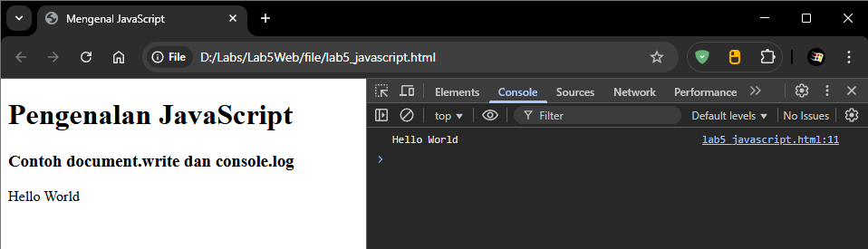

### JavaScript Dasar

Pemakaian Alert sebagai property window.

```html
<!DOCTYPE html>
<html lang="en">
<head>
    <title>alert box</title>
</head>
<body>
    <script language = "JavaScript">
        <!--
            window.alert("ini merupakan pesan untuk anda")
        //-->
    </script>
</body>
</html>
```

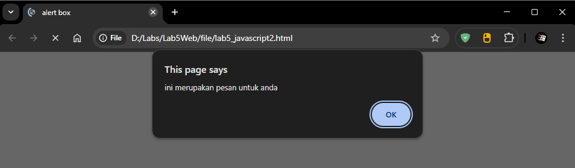

Pemakaian method dalam objek.

```html
<!DOCTYPE html>
<html lang="en">
<head>
    <title>skrip javascript</title>
</head>
<body>
    percobaan memakai javascript:<br>
    <script language = "JavaScript">
        <!--
          document.write("selamat mencoba javascript<br>");
          document.write("semoga sukses!");  
        //-->
    </script>
</body>
</html>
```

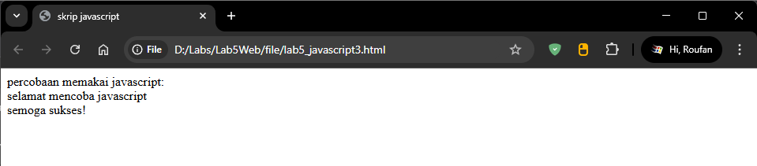

Pemakaian Prompt.

```html
<!DOCTYPE html>
<html lang="en">
<head>
    <title>Pemasukan data</title>
</head>
<body>
    <script language = "javascript">
        <!--
            var nama = prompt("siapa nama anda?","masukkan nama anda");
            document.write("hai, "+ nama);
        //-->
    </script>
</body>
</html>
```

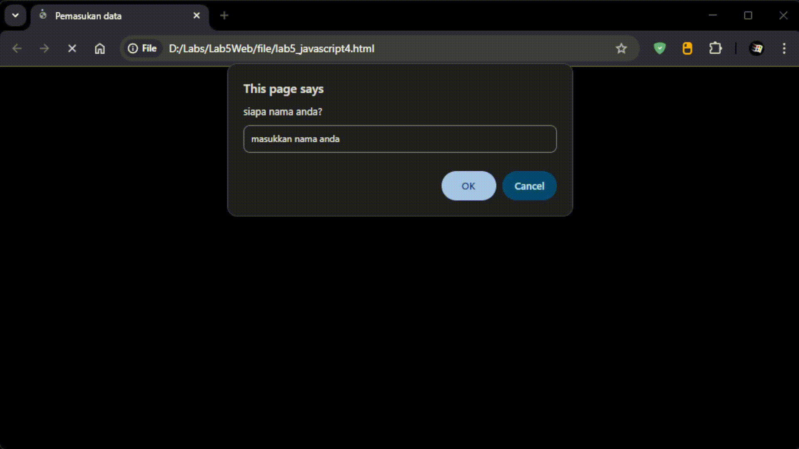

Pembuatan fungsi dan cara pemanggilannya.

```html
<!DOCTYPE html>
<html lang="en">
<head>
    <title>contoh program javascript</title>
    <script language = "javascript">
    function pesan(){
        alert ("memanggil javascript lewat body onload")
    }
    </script>
</head>
<body onload=pesan()>
</body>
</html>
```


### Dasar Pemograman Di Javascript

Operasi dasar aritmatika.

```html
<!DOCTYPE html>
<html lang="en">
<head>
    <title>contoh program javascript</title>

    <script language = "javascript">
    function test (val1,val2)
    {
        document.write("<br>"+"perkalian : val1*val2 "+"<br>")
        document.write(val1*val2)
        document.write("<br>"+"pembagian : val1/val2 "+"<br>")
        document.write(val1/val2)
        document.write("<br>"+"penjumlahan : val1+val2 "+"<br>")
        document.write(val1+val2)
        document.write("<br>"+"pengurangan : val1-val2 "+"<br>")
        document.write(val1-val2)
        document.write("<br>"+"modulus : val1%val2 "+"<br>")
        document.write(val1%val2)
    }
    </script>
</head>
<body>
    <input type="button" name="button1" value="arithmetic" onclick=test(9,4)>
</body>
</html>
```

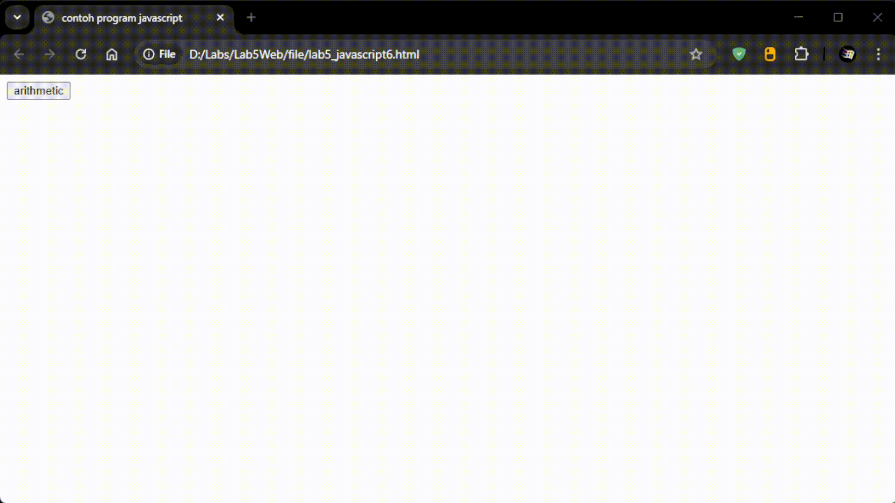

Seleksi Kondisi (if..else).

```html
<!DOCTYPE html> 
<html lang="en"> 
<head> 
    <title>Contoh if else</title> 
</head> 
<body> 
    <script language="javascript"> 
        <!--
        var nilai = prompt("nilai (0-100): ", 0); 
        var hasil = ""; 
        if (nilai >= 60) 
            hasil = "Lulus"; 
        else 
            hasil = "Tidak Lulus"; 
        document.write("hasil: " + hasil); 
        //-->
    </script> 
</body> 
</html> 
```

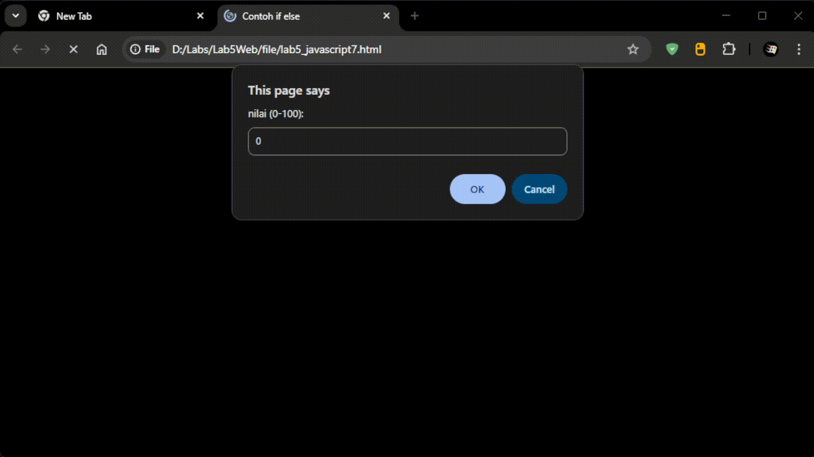

Penggunaan operator switch untuk seleksi kondisi.

```html
<!DOCTYPE html> 
<html lang="en"> 
<head> 
    <title>contoh program javascript</title> 

    <script language="javascript"> 
    function test ()
    {
        val1=window.prompt("input nilai (1-5):") 
        switch (val1) 
        { 
            case "1": 
                document.write("bilangan satu")
                break
            case "2": 
                document.write("bilangan dua")
                break
            case "3": 
                document.write("bilangan tiga")
                break
            case "4": 
                document.write("bilangan empat")
                break
            case "5": 
                document.write("bilangan lima")
                break
            default: 
                document.write("bilangan lainnya")
        } 
    }
    </script>
</head>
<body>
    <input type="button" name="button1" value="switch" onclick=test()>
</body> 
</html> 
```

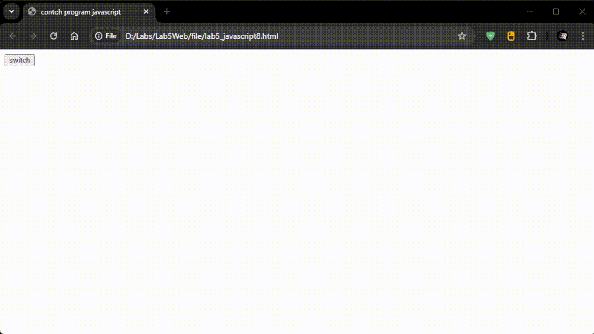

### Pembuatan Form

Form Input.

```html
<!DOCTYPE html> 
<html lang="en"> 
<head> 
    <script language="javascript">
    function test () {
        var val1=document.kirim.T1.value
        if (val1%2==0)
            document.kirim.T2.value="bilangan genap"
        else
            document.kirim.T2.value="bilangan ganjil"
    }
    </script>
</head> 
<body> 
    <form method="POST" name="kirim">
        <p>>BIL <input type="text" name="T1" size="20">
        MERUPAKAN BIL <input type="text" name="T2" size="20"></p>
        <P><input type="button" value="TEBAK" name="B1" onclick=test()></P>
        </form>
</body> 
</html> 
```

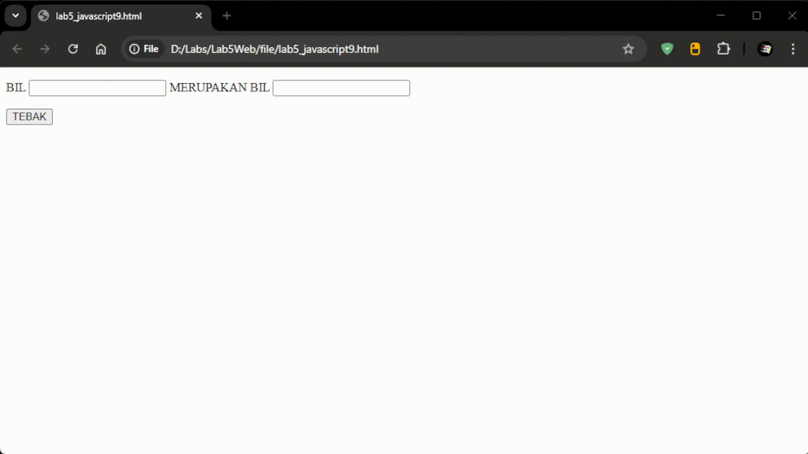

Form Button.

```html
<!DOCTYPE html> 
<html lang="en"> 
<head> 
    <title>objek document</title> 
</head> 
<body> 
    <script language="javascript"> 
        <!--
        function ubahWarnaLB(warna) {
            document.bgColor = warna;
        }
        function ubahWarnaLD(warna) {
            document.fgColor = warna;
        }
        //-->
    </script> 

    <h1>tes</h1>
    <form>
        <input type="button" value="Latar Belakang Hijau" onclick="ubahWarnaLB('GREEN')">
        <input type="button" value="Latar Belakang Putih" onclick="ubahWarnaLB('WHITE')">
        <input type="button" value="Teks Kuning" onclick="ubahWarnaLD('YELLOW')">
        <input type="button" value="Teks Biru" onclick="ubahWarnaLD('BLUE')">
    </form>
    <script language ="javascript">
    <!--
      document.write("Dimodifikasi terakhir pada " + document.lastModified);
    //-->
    </script>

</body> 
</html> 
```

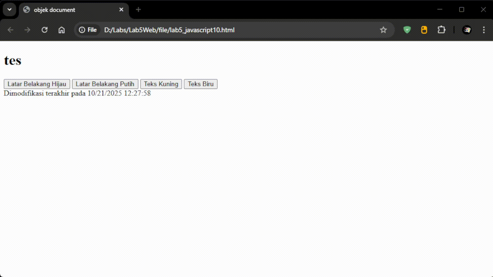

### HTML DOM

Pilihan menggunakan checkbox dengan perhitungan otomatis.

```html
<!DOCTYPE html>
<html lang="en">
<head>
    <title>Daftar Menu</title>
    <script>
        function hitung(ele) {
            var total = document.getElementById('total').value;
                total = (total ? parseInt(total) : 0);
            var harga = 0;

            if (ele.checked) {
                harga = ele.value;
                total += parseInt(harga);
            } else {
                harga = ele.value;
                if (total > 0)
                    total -= parseInt(harga);
            }

            document.getElementById('total').value = total;
        }
    </script>
</head>
<body>
    <h1>Daftar Menu Makanan</h1>
    <label><input type="checkbox" value="5000" id="menu1" onclick="hitung(this);" /> Ayam Goreng Rp. 5.000</label><br />
    <label><input type="checkbox" value="500" id="menu2" onclick="hitung(this);" /> Tempe Goreng Rp. 500</label><br />
    <label><input type="checkbox" value="2500" id="menu3" onclick="hitung(this);" /> Telur Goreng Rp. 2.500</label><br />
    <strong>Total Bayar: Rp, <input id="total" type="text" /></strong>
</body>
</html>
```

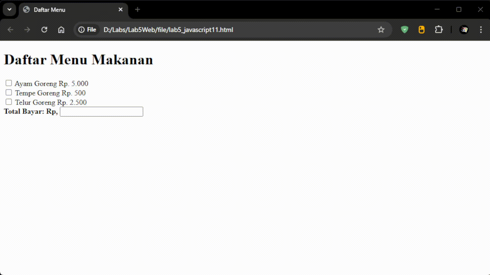

## Pertanyaan dan Tugas

### 1. Buat Script untuk melakukan validasi pada isian form.

Berikut Scriptnya

```html
<!DOCTYPE html>
<html lang="en">
<head>
    <title>Validasi Form</title>
    <script language="javascript">
        function validasi() {
            var nama = document.forms["form_validasi"]["nama"].value;
            var email = document.forms["form_validasi"]["email"].value;
            var pesan = document.forms["form_validasi"]["pesan"].value;

            if (nama == "") {
                alert("Nama tidak boleh kosong!");
                document.forms["form_validasi"]["nama"].focus();
                return false;
            }

            if (email == "") {
                alert("Email tidak boleh kosong!");
                document.forms["form_validasi"]["email"].focus();
                return false;
            }

            var pola_email = /^[^\s@]+@[^\s@]+\.[^\s@]+$/;
            if (!pola_email.test(email)) {
                alert("Format email tidak valid!");
                document.forms["form_validasi"]["email"].focus();
                return false;
            }

            if (pesan == "") {
                alert("Pesan tidak boleh kosong!");
                document.forms["form_validasi"]["pesan"].focus();
                return false;
            }

            alert("Form berhasil dikirim!");
            return true;
        }
    </script>
</head>
<body>
    <h3>Form Validasi JavaScript</h3>
    <form name="form_validasi" onsubmit="return validasi()">
        Nama: <input type="text" name="nama"><br><br>
        Email: <input type="text" name="email"><br><br>
        Pesan: <textarea name="pesan" rows="4" cols="30"></textarea><br><br>
        <input type="submit" value="Kirim">
        <input type="reset" value="Reset">
    </form>
</body>
</html>
```

Berikut demonstrasinya

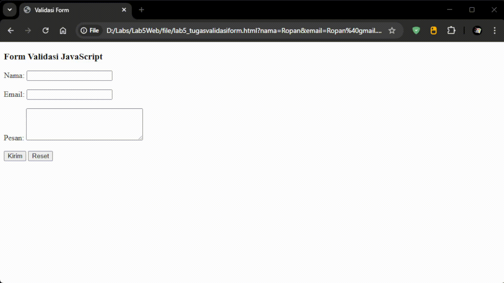

